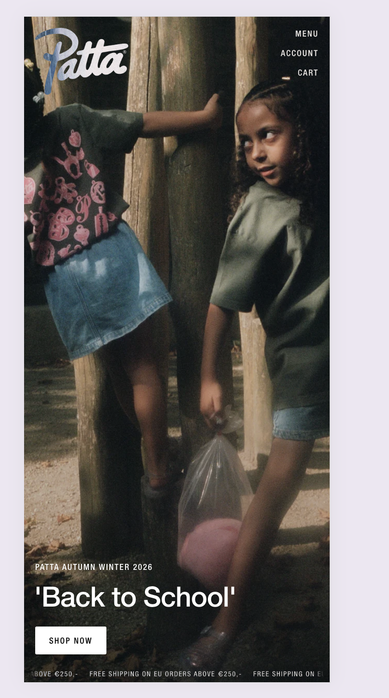
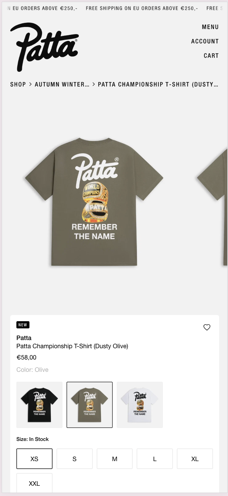
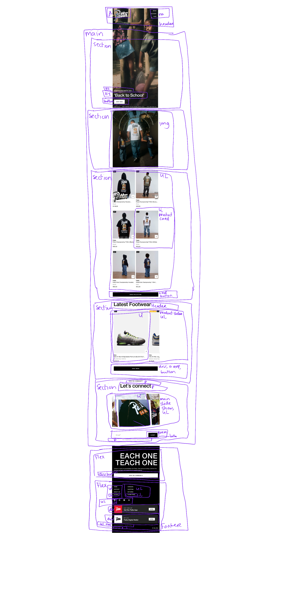
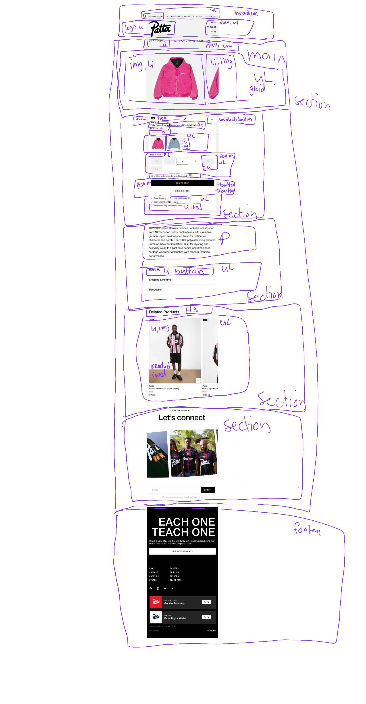
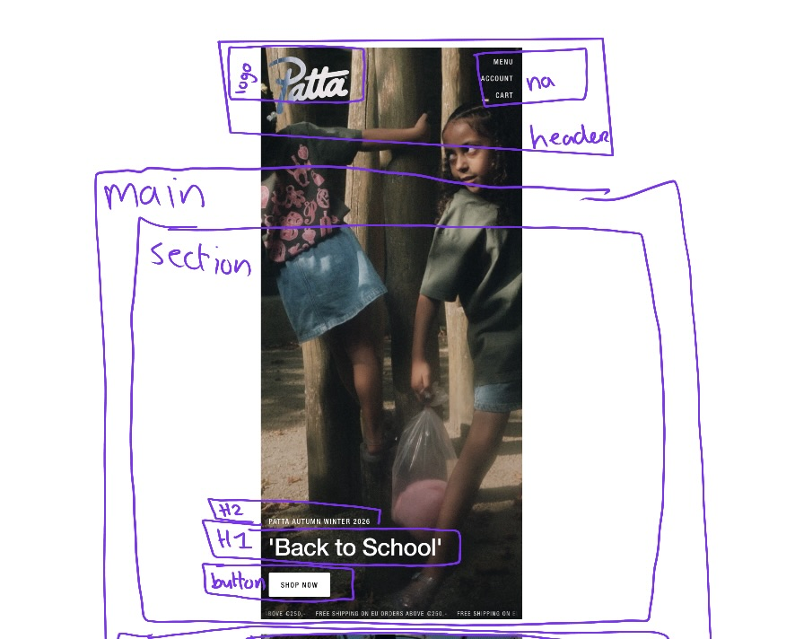
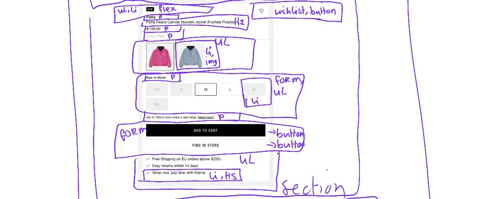
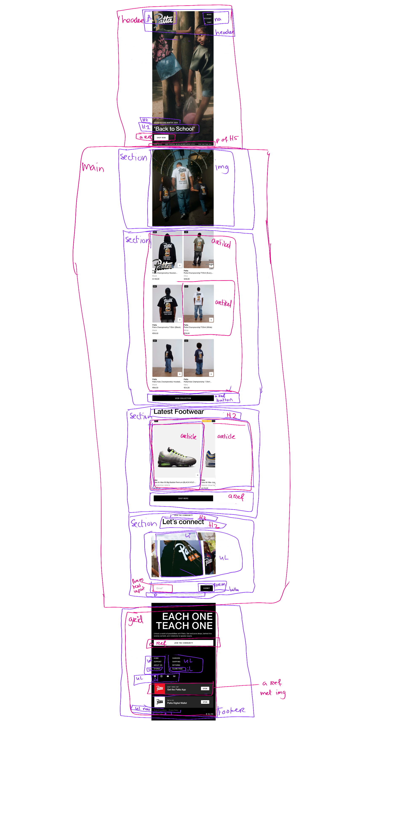
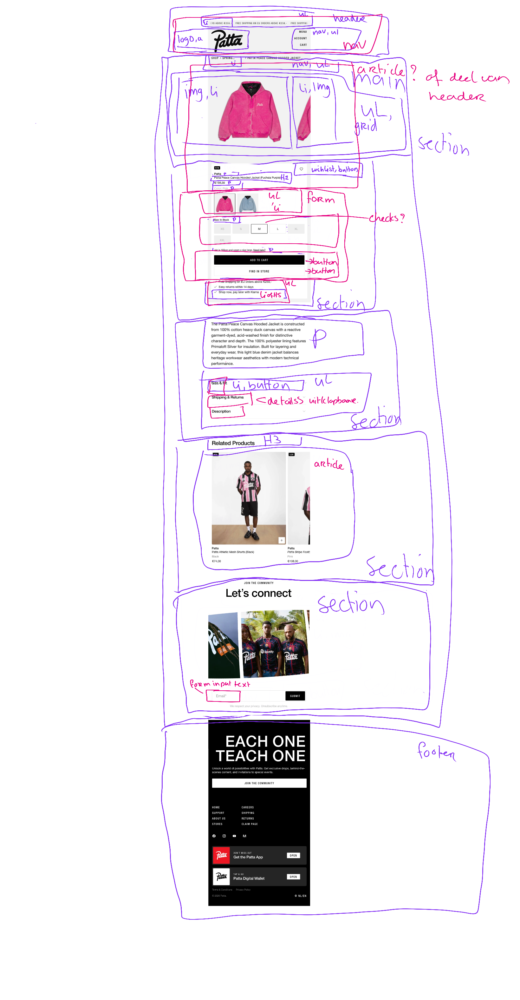
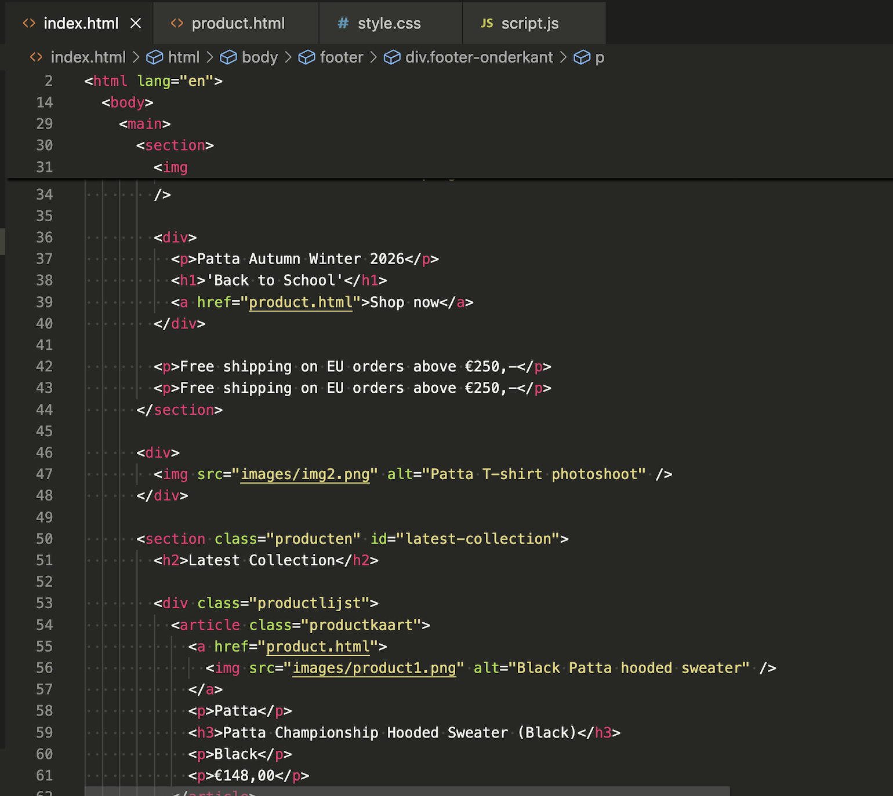
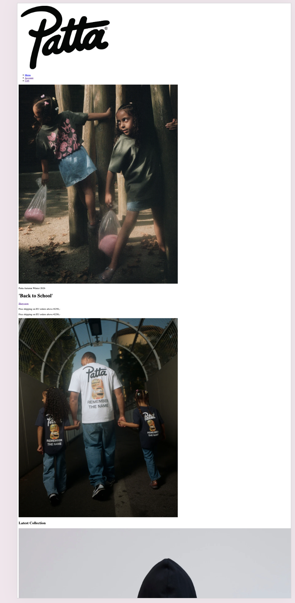

# Procesverslag
Markdown is een simpele manier om HTML te schrijven.  
Markdown cheat cheet: [Hulp bij het schrijven van Markdown](https://github.com/adam-p/markdown-here/wiki/Markdown-Cheatsheet).

Nb. De standaardstructuur en de spartaanse opmaak van de README.md zijn helemaal prima. Het gaat om de inhoud van je procesverslag. Besteedt de tijd voor pracht en praal aan je website.

Nb. Door *open* toe te voegen aan een *details* element kun je deze standaard open zetten. Fijn om dat steeds voor de relevante stuk(ken) te doen.

## Jij

  
uitwerken voor kick-off werkgroep

  ### Auteur:
  Mtima Ntenje

  #### Je startniveau:
  Blauw

  #### Je focus:
  Surface plane
 

## Je website

  
uitwerken voor kick-off werkgroep

  ### Je opdracht:
  link naar de website die je gaat namaken óf de naam/omschrijving van je eigen ontwerp

  https://patta.nl/
  

  #### Screenshot(s) van de eerste pagina (small screen): 
 Homepagina patta
  

  #### Screenshot(s) van de tweede pagina (small screen):
  Productpagina Patta Peace Canvas Hooded Jacket (Fuchsia Purple) 
  
 

## Toegankelijkheidstest 1/2 (week 1)

  
uitwerken na test in 2e werkgroep

  ### Bevindingen
  Lijst met je bevindingen die in de test naar voren kwamen:
De bevindingen die ik heb opgedaan na de eerste test zijn dat bij de content, global code en keyboard, headings, lists, images en controls alles goed is op de originele website.
Dewi geeft wel aan dat bij het stukje over keyboard dat het op de website soms lastig is omdat hij stukjes overslaat of iets niet goed aangeeft omdat de patta site veel verborgen op de site heeft wat niet te zien is maar wel word voorgelezen. Bij mobile en touch is horizontaal scrollen niet van toepassing. Daarnaast heeft de website wel video's alleen spelen deze automatisch af en kunnen deze niet gepauzeerd worden of uitgezet worden dat ze niet meteen auto play afspelen. Daarnaast wordt high contrast mode niet ondersteund en heeft de website geen light- en darkmodeversie.

## Breakdownschets (week 1)

  
uitwerken na afloop 3e werkgroep

  ### de hele pagina: 
  

  ### dynamisch deel (bijv menu): 
  

  ### wellicht nog een dynamisch deel (bijv filter): 
  

## Voortgang 1 (week 2)

  
uitwerken voor 1e voortgang

  ### Stand van zaken
  Bij voortgangsgesprek 1 heb ik mijn breakdownschetsen aan Danny laten zien en gevraagd om feedback.

  ### Verslag van meeting
  Er waren nog een paar punten die ik beter anders kon doen of dingen die nog toegevoegd moesten worden:

- Uitklapmenu’s op de productpagina maken met < details>.
- Kleur, maat en Add to Cart samenvoegen in één < form> en de juiste input-elementen gebruiken.
- Beter kijken naar de semantische opbouw van de < header> en < nav> op beide pagina’s.
- Op de homepagina de hero/intro onderdeel maken van de < header>.
- Producten opbouwen met losse < article>-elementen in plaats van < ul> en < li>.
- Links naar andere pagina’s als < a href=""> gebruiken in plaats van < button>, en deze met CSS als knop stylen.
- Headingstructuur verbeteren, bijvoorbeeld Latest Footwear en Let’s Connect als h2.
- Formulieren voorzien van de juiste form- en input-elementen.
- Footer met CSS Grid opbouwen in plaats van Flexbox.
- Klikbare < div>-elementen in de footer vervangen door < a>-elementen.

  Na het voortgangsgesprek heb ik mijn breakdownschetsen aangepast:
  
  
  

## Voortgang 2 (week 3)

  
uitwerken voor 2e voortgang

  ### Stand van zaken
Tijdens dit voortgangsgesprek stond de basis van mijn HTML. De structuur van de twee pagina’s was grotendeels aanwezig, maar de styling en interacties moesten nog verder worden uitgewerkt. Daardoor had ik nog niet veel werkende onderdelen om te demonstreren.

Ik heb mijn HTML-code laten zien en vragen gesteld over hoe ik bepaalde onderdelen van de Patta-website kon namaken. Dit ging onder andere over:

de automatisch bewegende carrousel bij “Let’s connect”;

de tekst “Each One Teach One” die tijdens het scrollen in beeld beweegt;

welke interacties ik met CSS kon maken;

voor welke onderdelen JavaScript nodig zou zijn;

hoe ik extra aandacht kon besteden aan de surface plane.

De HTML-structuur ging al redelijk goed. Het lastigste vond ik om te bepalen welke techniek ik voor iedere interactie moest gebruiken en hoe ik de animaties op een toegankelijke manier kon uitwerken.

 
### Verslag van meeting
Tijdens het gesprek kreeg ik de volgende feedback en adviezen:

Voor de carrousel kon ik voornamelijk CSS gebruiken, bijvoorbeeld met horizontale overflow, scroll snap en een CSS-animatie.

Voor de footeranimatie kon ik gebruikmaken van scroll-driven animations.

De docent verwees mij voor de footeranimatie naar de documentatie van Chrome Developers:
https://developer.chrome.com/docs/css-ui/scroll-driven-animations?hl=nl

Daarnaast kreeg ik de website Scroll-driven Animations als bron voor uitleg en voorbeelden:
https://scroll-driven-animations.style/#learn

JavaScript hoefde niet voor iedere animatie te worden gebruikt. CSS was geschikter voor de visuele bewegingen.

JavaScript kon ik later gebruiken voor uitgebreidere interacties, zoals het selecteren van een kleur en maat en het toevoegen van een product aan het winkelmandje.

Ik moest bij de animaties ook rekening houden met toegankelijkheid, bijvoorbeeld door prefers-reduced-motion toe te voegen.

## Toegankelijkheidstest 2/2 (week 4)

  
uitwerken na test in 9e werkgroep

  ### Bevindingen
  Lijst met je bevindingen die in de test naar voren kwamen (geef ook aan wat er verbeterd is):

## Voortgang 3 (week 4)

  
uitwerken voor 3e voortgang

  ### Stand van zaken
Ik heb geen gebruik gemaakt van voortgangsgesprek 3.

## Eindgesprek (week 5)

  
uitwerken voor eindgesprek

  ### Je uitkomst - karakteristiek screenshots:
  

  ### Dit ging goed/Heb ik geleerd: 
  Korte omschrijving met plaatjes

  

  ### Dit was lastig/Is niet gelukt:
  Korte omschrijving met plaatjes

  

## Bronnenlijst

  
continu bijhouden terwijl je werkt

  Nb. Wees specifiek ('css-tricks' als bron is bijv. niet specifiek genoeg). 
  Nb. ChatGpT en andere AI horen er ook bij.
  Nb. Vermeld de bronnen ook in je code.

  1. bron 1
  2. bron 2
  3. ...

