# Procesverslag
Markdown is een simpele manier om HTML te schrijven.  
Markdown cheat cheet: [Hulp bij het schrijven van Markdown](https://github.com/adam-p/markdown-here/wiki/Markdown-Cheatsheet).

Nb. De standaardstructuur en de spartaanse opmaak van de README.md zijn helemaal prima. Het gaat om de inhoud van je procesverslag. Besteedt de tijd voor pracht en praal aan je website.

Nb. Door *open* toe te voegen aan een *details* element kun je deze standaard open zetten. Fijn om dat steeds voor de relevante stuk(ken) te doen.

## Jij

  
uitwerken voor kick-off werkgroep

  ### Auteur:
  Mtima Ntenje

  #### Je startniveau:
  Blauw

  #### Je focus:
  Surface plane
 

## Je website

  
uitwerken voor kick-off werkgroep

  ### Je opdracht:
  link naar de website die je gaat namaken óf de naam/omschrijving van je eigen ontwerp

  https://patta.nl/
  

  #### Screenshot(s) van de eerste pagina (small screen): 
 Homepagina patta
  

  #### Screenshot(s) van de tweede pagina (small screen):
  Productpagina Patta Peace Canvas Hooded Jacket (Fuchsia Purple) 
  
 

## Toegankelijkheidstest 1/2 (week 1)

  
uitwerken na test in 2e werkgroep

  ### Bevindingen
  Lijst met je bevindingen die in de test naar voren kwamen:
De bevindingen die ik heb opgedaan na de eerste test zijn dat bij de content, global code en keyboard, headings, lists, images en controls alles goed is op de originele website.
Dewi geeft wel aan dat bij het stukje over keyboard dat het op de website soms lastig is omdat hij stukjes overslaat of iets niet goed aangeeft omdat de patta site veel verborgen op de site heeft wat niet te zien is maar wel word voorgelezen. Bij mobile en touch is horizontaal scrollen niet van toepassing. Daarnaast heeft de website wel video's alleen spelen deze automatisch af en kunnen deze niet gepauzeerd worden of uitgezet worden dat ze niet meteen auto play afspelen. Daarnaast wordt high contrast mode niet ondersteund en heeft de website geen light- en darkmodeversie.

## Breakdownschets (week 1)

  
uitwerken na afloop 3e werkgroep

  ### de hele pagina: 
  

  ### dynamisch deel (bijv menu): 
  

  ### wellicht nog een dynamisch deel (bijv filter): 
  

## Voortgang 1 (week 2)

  
uitwerken voor 1e voortgang

  ### Stand van zaken
  Bij voortgangsgesprek 1 heb ik mijn breakdownschetsen aan Danny laten zien en gevraagd om feedback.

  ### Verslag van meeting
  Er waren nog een paar punten die ik beter anders kon doen of dingen die nog toegevoegd moesten worden:

- Uitklapmenu’s op de productpagina maken met < details>.
- Kleur, maat en Add to Cart samenvoegen in één < form> en de juiste input-elementen gebruiken.
- Beter kijken naar de semantische opbouw van de < header> en < nav> op beide pagina’s.
- Op de homepagina de hero/intro onderdeel maken van de < header>.
- Producten opbouwen met losse < article>-elementen in plaats van < ul> en < li>.
- Links naar andere pagina’s als < a href=""> gebruiken in plaats van < button>, en deze met CSS als knop stylen.
- Headingstructuur verbeteren, bijvoorbeeld Latest Footwear en Let’s Connect als h2.
- Formulieren voorzien van de juiste form- en input-elementen.
- Footer met CSS Grid opbouwen in plaats van Flexbox.
- Klikbare < div>-elementen in de footer vervangen door < a>-elementen.

  Na het voortgangsgesprek heb ik mijn breakdownschetsen aangepast:
  
  
  

## Voortgang 2 (week 3)

  
uitwerken voor 2e voortgang

  ### Stand van zaken
Tijdens dit voortgangsgesprek stond de basis van mijn HTML. De structuur van de twee pagina’s was grotendeels aanwezig, maar de styling en interacties moesten nog verder worden uitgewerkt. Daardoor had ik nog niet veel werkende onderdelen om te demonstreren.

Ik heb mijn HTML-code laten zien en vragen gesteld over hoe ik bepaalde onderdelen van de Patta-website kon namaken. Dit ging onder andere over:

de automatisch bewegende carrousel bij “Let’s connect”;

de tekst “Each One Teach One” die tijdens het scrollen in beeld beweegt;

welke interacties ik met CSS kon maken;

voor welke onderdelen JavaScript nodig zou zijn;

hoe ik extra aandacht kon besteden aan de surface plane.

De HTML-structuur ging al redelijk goed. Het lastigste vond ik om te bepalen welke techniek ik voor iedere interactie moest gebruiken en hoe ik de animaties op een toegankelijke manier kon uitwerken.

 
### Verslag van meeting
Tijdens het gesprek kreeg ik de volgende feedback en adviezen:

Voor de carrousel kon ik voornamelijk CSS gebruiken, bijvoorbeeld met horizontale overflow, scroll snap en een CSS-animatie.

Voor de footeranimatie kon ik gebruikmaken van scroll-driven animations.

De docent verwees mij voor de footeranimatie naar de documentatie van Chrome Developers:
https://developer.chrome.com/docs/css-ui/scroll-driven-animations?hl=nl

Daarnaast kreeg ik de website Scroll-driven Animations als bron voor uitleg en voorbeelden:
https://scroll-driven-animations.style/#learn

JavaScript hoefde niet voor iedere animatie te worden gebruikt. CSS was geschikter voor de visuele bewegingen.

JavaScript kon ik later gebruiken voor uitgebreidere interacties, zoals het selecteren van een kleur en maat en het toevoegen van een product aan het winkelmandje.

Ik moest bij de animaties ook rekening houden met toegankelijkheid, bijvoorbeeld door prefers-reduced-motion toe te voegen.

## Toegankelijkheidstest 2/2 (week 4)

  
uitwerken na test in 9e werkgroep

  ### Bevindingen
  Lijst met je bevindingen die in de test naar voren kwamen (geef ook aan wat er verbeterd is):

## Voortgang 3 (week 4)

  
uitwerken voor 3e voortgang

  ### Stand van zaken
Ik heb geen gebruik gemaakt van voortgangsgesprek 3.

## Eindgesprek (week 5)

  
uitwerken voor eindgesprek

  ### Je uitkomst - karakteristiek screenshots:
  scherm 1
 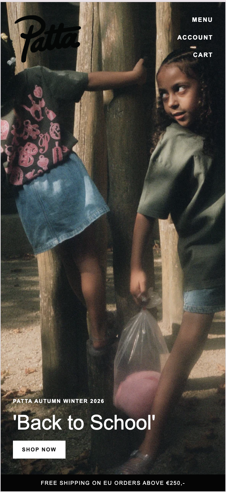
  
   scherm 2
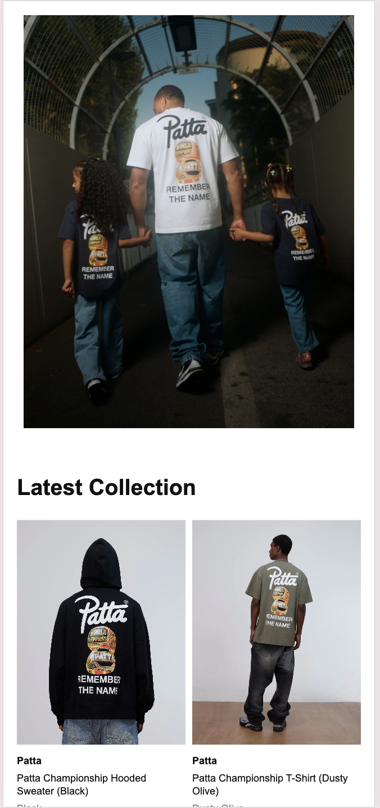
 
  scherm 3
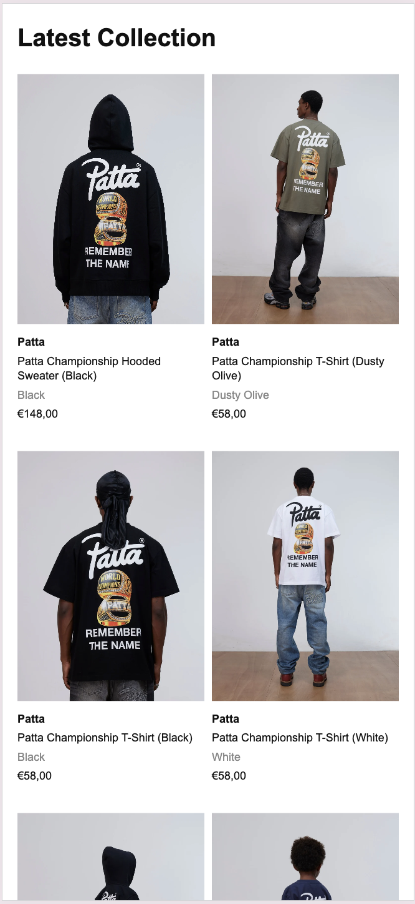
 
  scherm 4
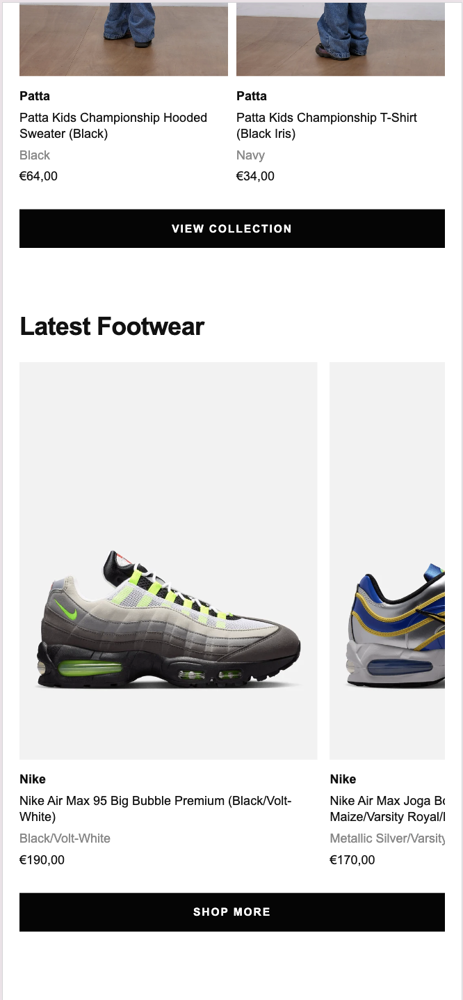
 
  scherm 5
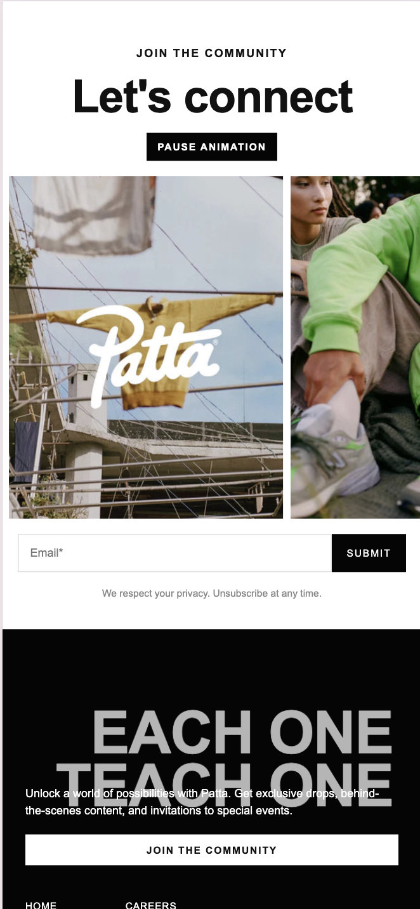
 
  scherm 6
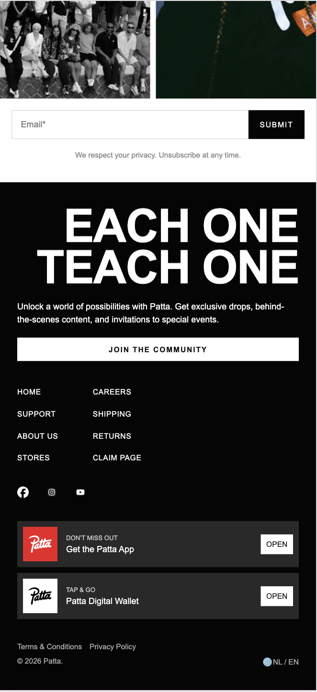
 
  scherm 7
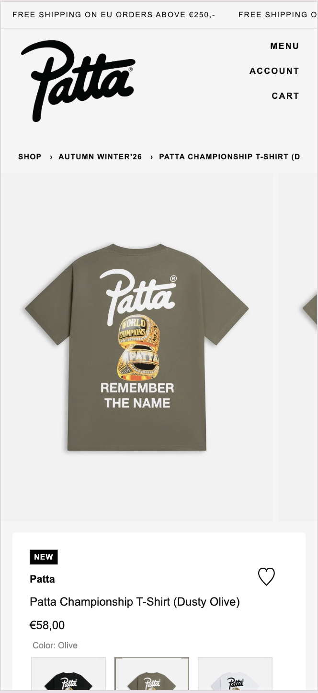
 
  scherm 8
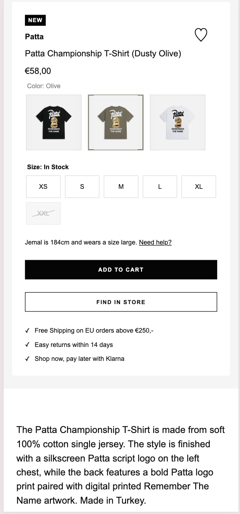
 
  scherm 9
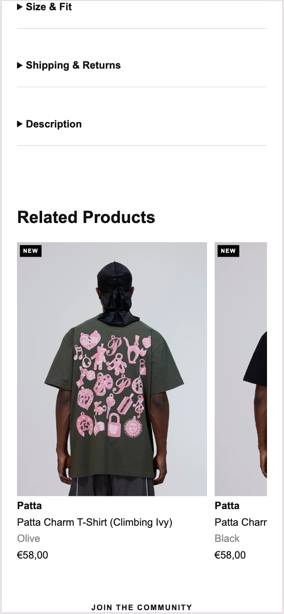
 
  scherm 10
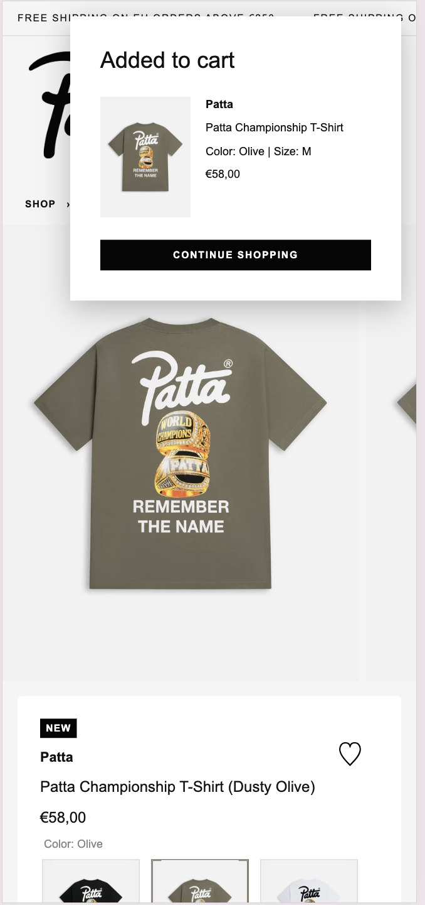
 
  scherm 11
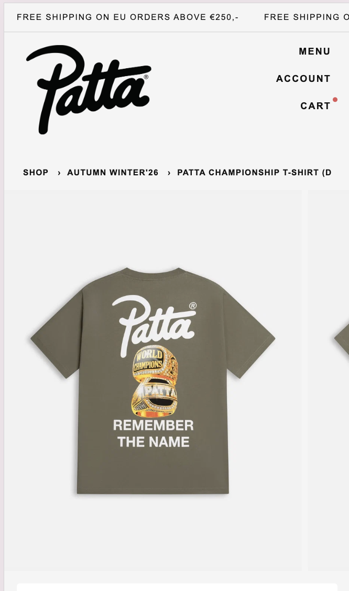

  ### Dit ging goed/Heb ik geleerd: 
Ik ben vooral tevreden over de productpagina. De gebruiker kan een kleur en maat kiezen en het product toevoegen aan het winkelmandje. Daarna verschijnen de gekozen opties in een popup en komt er een rood bolletje bij Cart te staan.

Ook is het gelukt om de “Let’s connect”-carrousel automatisch te laten bewegen, een scrollanimatie aan de footer toe te voegen en rekening te houden met prefers-reduced-motion.

  ### Dit was lastig/Is niet gelukt:
  Het is niet helemaal gelukt om de “Let’s connect”-carrousel hetzelfde te laten bewegen als op de officiële Patta-website. Op de originele website bewegen de afbeeldingen niet alleen horizontaal, maar draaien ze tijdens de beweging ook een beetje schuin. Mijn carrousel beweegt alleen horizontaal.

Ik vind het jammer dat dit verschil zichtbaar blijft. Voor de schuine beweging was complexere animatiecode nodig die ik op dit moment nog niet goed genoeg begrijp en daardoor ook niet goed zou kunnen uitleggen. Daarom heb ik gekozen voor een eenvoudigere animatie die ik wel begrijp en kan aanpassen.

Daarnaast wilde ik de kopjes “Latest Footwear” en “Let’s connect” tijdens het scrollen laten inspringen, zoals de tekst in de footer. Dit werkte niet goed: de kopjes verdwenen soms of kwamen op een verkeerde positie terecht. Daarom heb ik deze animatie alleen bij “Each One Teach One” in de footer gehouden.

Mijn uitwerking van de carrousel:

 
Patta's officiele website:
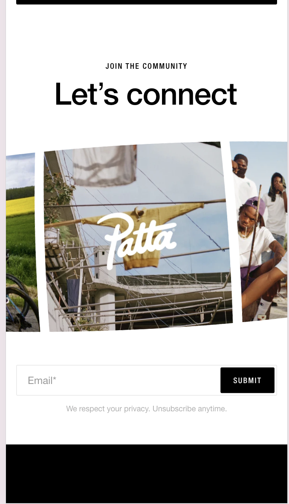

## Bronnenlijst

  
continu bijhouden terwijl je werkt

 ## Bronnenlijst

### Lesmateriaal

- Hogeschool van Amsterdam. *FED 25–26 – Blok 1 – Intro media queries*.
  Gebruikt voor media queries, responsive styling en `prefers-reduced-motion`.
  [https://dlo.mijnhva.nl/content/enforced/778436-FDMCI-CRS-00051001-CMD-2627/FED%2025-26%20-%20Blok%201%20-%20Intro%20media%20queries.pdf](https://dlo.mijnhva.nl/content/enforced/778436-FDMCI-CRS-00051001-CMD-2627/FED%2025-26%20-%20Blok%201%20-%20Intro%20media%20queries.pdf)

- Hogeschool van Amsterdam. *FED 25–26 – Blok 1 – Beoordelingsformulier*.
  Gebruikt om de technische voorwaarden, de surface plane en de beoordelingscriteria te controleren.

- Hogeschool van Amsterdam. *FED 25–26 – Blok 1 – WCAG-checklist*.
  Gebruikt voor het controleren van de toegankelijkheid van de website.

- Shooft. *Voorbeeld van een modeless dialog*. CodePen.
  Gebruikt als voorbeeld voor het openen en sluiten van het winkelmandje met het HTML-element `<dialog>`.
  [https://codepen.io/shooft/pen/azvKYVZ](https://codepen.io/shooft/pen/azvKYVZ)

### Ontwerp en content

- Patta. *Officiële website*.
  Gebruikt als visuele inspiratie voor de homepage, productkaarten, carrousels, typografie, navigatie en footer.
  [https://patta.nl/](https://patta.nl/)

### HTML

- MDN Web Docs. *The dialog element*.
  Gebruikt voor het winkelmandje als modeless dialog en het openen en sluiten daarvan met JavaScript.
  [https://developer.mozilla.org/en-US/docs/Web/HTML/Reference/Elements/dialog](https://developer.mozilla.org/en-US/docs/Web/HTML/Reference/Elements/dialog)

- MDN Web Docs. *The details disclosure element*.
  Gebruikt voor de uitklapbare onderdelen “Size & Fit”, “Shipping & Returns” en “Description”.
  [https://developer.mozilla.org/en-US/docs/Web/HTML/Reference/Elements/details](https://developer.mozilla.org/en-US/docs/Web/HTML/Reference/Elements/details)

- MDN Web Docs. *How to structure a web form*.
  Gebruikt voor de opbouw van de formulieren met `form`, `fieldset`, `legend`, `label` en `input`.
  [https://developer.mozilla.org/en-US/docs/Learn_web_development/Extensions/Forms/How_to_structure_a_web_form](https://developer.mozilla.org/en-US/docs/Learn_web_development/Extensions/Forms/How_to_structure_a_web_form)

- MDN Web Docs. *Input type radio*.
  Gebruikt voor het selecteren van één productkleur en één maat.
  [https://developer.mozilla.org/en-US/docs/Web/HTML/Reference/Elements/input/radio](https://developer.mozilla.org/en-US/docs/Web/HTML/Reference/Elements/input/radio)

### CSS

- MDN Web Docs. *CSS Grid Layout*.
  Gebruikt voor de layout van de pagina’s, productkaarten, formulieren, header en footer.
  [https://developer.mozilla.org/en-US/docs/Web/CSS/Guides/Grid_layout](https://developer.mozilla.org/en-US/docs/Web/CSS/Guides/Grid_layout)

- MDN Web Docs. *Using CSS custom properties*.
  Gebruikt voor de kleuren, witruimte, tekstgroottes en andere herbruikbare waarden in `:root`.
  [https://developer.mozilla.org/en-US/docs/Web/CSS/Guides/Cascading_variables/Using_custom_properties](https://developer.mozilla.org/en-US/docs/Web/CSS/Guides/Cascading_variables/Using_custom_properties)

- MDN Web Docs. *Creating CSS carousels*.
  Gebruikt voor de horizontaal scrollende carrousels op de website.
  [https://developer.mozilla.org/en-US/docs/Web/CSS/Guides/Overflow/Carousels](https://developer.mozilla.org/en-US/docs/Web/CSS/Guides/Overflow/Carousels)

- MDN Web Docs. *CSS Scroll Snap*.
  Gebruikt om onderdelen van een carrousel na het scrollen op een vaste positie te laten stoppen.
  [https://developer.mozilla.org/en-US/docs/Web/CSS/Guides/Scroll_snap](https://developer.mozilla.org/en-US/docs/Web/CSS/Guides/Scroll_snap)

- MDN Web Docs. *Prefers-reduced-motion*.
  Gebruikt om animaties te verminderen voor gebruikers die deze toegankelijkheidsvoorkeur hebben ingesteld.
  [https://developer.mozilla.org/en-US/docs/Web/CSS/Reference/At-rules/@media/prefers-reduced-motion](https://developer.mozilla.org/en-US/docs/Web/CSS/Reference/At-rules/@media/prefers-reduced-motion)

- Chrome for Developers. *Animate elements on scroll with scroll-driven animations*.
  Gebruikt voor de scrollanimatie van “Each One Teach One” in de footer.
  [https://developer.chrome.com/docs/css-ui/scroll-driven-animations](https://developer.chrome.com/docs/css-ui/scroll-driven-animations)

- Bramus. *Scroll-driven Animations*.
  Gebruikt voor uitleg en voorbeelden van animaties die reageren op de scrollpositie.
  [https://scroll-driven-animations.style/#learn](https://scroll-driven-animations.style/#learn)

### JavaScript

- MDN Web Docs. *Document: querySelector() method*.
  Gebruikt om HTML-elementen vanuit JavaScript te selecteren.
  [https://developer.mozilla.org/en-US/docs/Web/API/Document/querySelector](https://developer.mozilla.org/en-US/docs/Web/API/Document/querySelector)

- MDN Web Docs. *Document: querySelectorAll() method*.
  Gebruikt om meerdere kleur- en maatkeuzes vanuit JavaScript te selecteren.
  [https://developer.mozilla.org/en-US/docs/Web/API/Document/querySelectorAll](https://developer.mozilla.org/en-US/docs/Web/API/Document/querySelectorAll)

- MDN Web Docs. *EventTarget: addEventListener() method*.
  Gebruikt om te reageren op klikken, formulierverzendingen, wijzigingen en toetsenbordinvoer.
  [https://developer.mozilla.org/en-US/docs/Web/API/EventTarget/addEventListener](https://developer.mozilla.org/en-US/docs/Web/API/EventTarget/addEventListener)

- MDN Web Docs. *HTMLDialogElement: show() method*.
  Gebruikt om het winkelmandje als een modeless dialog te openen.
  [https://developer.mozilla.org/en-US/docs/Web/API/HTMLDialogElement/show](https://developer.mozilla.org/en-US/docs/Web/API/HTMLDialogElement/show)

- MDN Web Docs. *CSSStyleDeclaration: setProperty() method*.
  Gebruikt om een CSS custom property vanuit JavaScript aan te passen wanneer een andere productkleur wordt geselecteerd.
  [https://developer.mozilla.org/en-US/docs/Web/API/CSSStyleDeclaration/setProperty](https://developer.mozilla.org/en-US/docs/Web/API/CSSStyleDeclaration/setProperty)

- MDN Web Docs. *Window: setTimeout() method*.
  Gebruikt om het winkelmandje na vijf seconden automatisch te sluiten.
  [https://developer.mozilla.org/en-US/docs/Web/API/Window/setTimeout](https://developer.mozilla.org/en-US/docs/Web/API/Window/setTimeout)

### Validatie

- W3C. *Nu HTML Checker*.
  Gebruikt om de HTML-code te controleren op fouten en waarschuwingen.
  [https://validator.w3.org/nu/](https://validator.w3.org/nu/)

- W3C. *CSS Validation Service*.
  Gebruikt om de CSS-code te controleren op fouten en waarschuwingen.
  [https://jigsaw.w3.org/css-validator/](https://jigsaw.w3.org/css-validator/)

### Gebruik van AI

- OpenAI. *ChatGPT*.
Tijdens dit project heb ik ChatGPT gebruikt als hulpmiddel bij het controleren en verbeteren van mijn HTML-, CSS- en JavaScriptcode. Ik heb AI onder andere gebruikt voor uitleg over semantische HTML, CSS Grid, custom properties, toegankelijkheid en JavaScript-interacties. Ook heb ik AI gebruikt om fouten en dubbele code op te sporen.
  [https://chatgpt.com/](https://chatgpt.com/)
Aantal prompts die ik heb gebruikt:
- “Hoe kan ik een product met een gekozen kleur en maat aan een winkelmandje toevoegen?”
- “Hoe maak ik met CSS een horizontaal scrollende carrousel?”
- “Hoe gebruik ik prefers-reduced-motion voor toegankelijkheid?”
- “Kun je controleren of mijn HTML semantisch is opgebouwd?”
- “Kun je dubbele of ongebruikte CSS-regels aanwijzen?”
- “Kun je al mijn bronnen in een overzichtelijke bronnenlijst zetten?”

